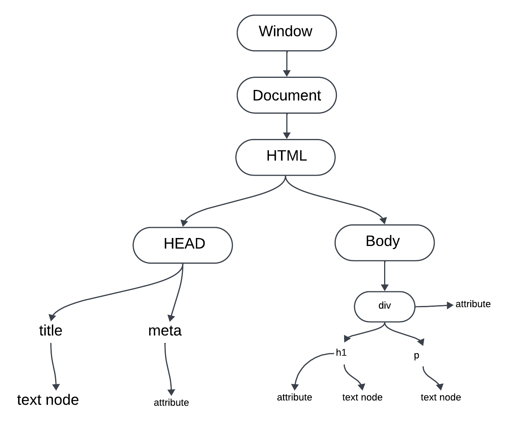

# DOM Manipulation

- Inside console we can know the getURI in inspect of browser of 
- document.baseURI
- document.links  (It is html collection)
- console.log(document.links[2])

## We can also select a particular element,
- take its id and use
- document.getElementById('firstHeading')
- document.getElementById('firstHeading').innerHTML = "<h1>Chai aur code</h1>" 
This is for manipulation.

- we can use 

# Events in Browser