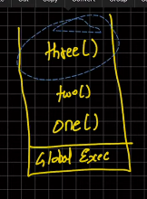

# javascript execution context

This means how a java code runs and execute

Runs in two phases:

- **Global Execution context**
    -- refered to the variable which is "this"
    -- Inside browser "this" values is window which is object in the global context 
    -- All executes inside a thread
    -- javascript is a single threaded
- **Functional Execution context**
    -- 
- **Eval Execution Context**

The two phases on how a javascript code runs are:
- **Memory Creation Phase (Creation Phase)**
    -- here, for the variable or anything declared, the memory or place is allocated.
- **Execution phase**
    -- All the execution happens here in the execution phase.
```
let val1 = 10
let val2 = 5
function addNum(num1, num2) {
    let total = num1 + num2
    return total
}

let result1 = addNum(val1, val2)
let result2 = addNum(10, 2)
```
How this function will execute?
1. **Global execution (Global Environment)**
    - However long or short the code is executed from global execution and then it is first located inside "this"
2. **Memory Creation Phase**
    All the variable is stacked and is just kept here.
    - val1 = undefined
    - val2 = undefined
    - addnum = defination, because here we are just declaring not executing.
    - result1 = undefined
    - result2 = undefined
This first cycle will happen no matter what.
3. **Execution phase:**
    -- val1 = 10
    -- val2 = 5
    -- addnum function will not have value, because there is nothing to execute
Then comes the calling of function in result1 and result2:
    Inside, addnum there will be onemore execution context.
    -- addnum = newvariable environment + Execution thread
The more the function is called, the more the execution context is made.
And, Again inside this new execution context, the the memory phase and execution phase is made. It is for addNum function
    -- Memory phase
        --- val1 = undefined
        --- val1 = undefined
        --- total = undefined
    -- Execution phase
        --- num1 = 10
        --- num2 = 5
        --- total = 15 (here, there will be calculating)
        --- total will be returned to its parent execution context. (Global Execution context)
After all this, the newly made execution context inside a function is deleted as well.
now, in global exevution phase (no.3)L
- result1 = 15
- next again in result2, a function is executes in newly made execution context, and again the story repeats returning total value to parent execution context.


All of this is basic, now we will see call stack

# call stack

Global execution context
methods:
    one()
    two()
    three()

when one() method is executed inside the Global execution context:

**lifo concept:** Last In and First Out

is used,
for instance, there is three() method is called inside two() and two() is called inside the one().

Which will be executed first?
Ans: The last in first out concept, where if the last one is three() to be executed inside the global execution context, then the three() is method which is executed first and passed to parent execution, then two() and then one()


