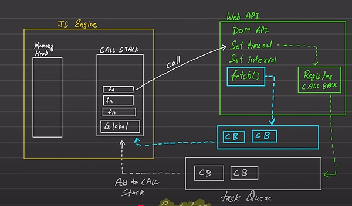

# Javascript Async Code

## Javascript (Default)
- **Synchronous:** One code gets executed first and then another code gets executed.
- **Single Threaded** 

## Execution Context
- Execute one line of code at a time
    - console.log => 1
    - console.log => 2
Each Operation waits for the one line to execute, and then another code get's executed.
so, regarding execution, we should know a little about the memory management and how ``js`` stores and calls value from memory. It is generally: ``call stack`` and ``memory heap``.

## Blocking Code v/s Non Blocking Code.

- **Blocking Code:** Block the flow of Program, Read File Sync
- **Non-Blocking Code:** Does not block execution, Read File Async

In Operating system, Program can't read files directly. To read files, the context should be given to kernel, kernel goes and access the files or programs, and reads whatever material is there. After, that the execution permission is given to programs from the kernel and after all that work is done. 

## JS Engine, Web API, Task-Queue, and High-priority queue.
### JS Engine
- The core JS engine is composed of **memory heap**, and **CALL STACK**. 
    - As, previously explained in **execution context**, we could understand memory heap is where objects, functions, and variables are stored in memory. It is a large, unordered region in memory used for managing dynamic data like objects and arrays.
    - **CALL STACK** is a stack data structure used to manage the execution of functions. It keeps track of what funtion is currently being executed and what functions are to be executed next. When a function is invoked, it is pushed onto the stack. Once the function execution is complete, it is popped off the stack.

    For instance, if greet() function is called then, it "greet" is pushed onto the call stack, executed, and then popped.

### Web API
- Web API is found in the browser.
- Besides Web API, environment is also given which is generally node.

If, web api is given, then DOM is given there, which is in browser. If, we use node, then DOM will not be present there. It is all based on usage.

### Task-queue
- Task-queue is the part which makes Javascript, so asynchronous, and fast.

so, when we use set_interval() function, set_timeout() function, and fetch() function, which comes into the webAPI category, it creates a REGISTER CALLBACK. 

For instance, if we use, set_interval(1), the code which is put to execute after this set_interval() will be put into REGISTER CALLBACK, and only after this set interval, the code gets executed. This all happens, by lining it up like queue and which is called Task-queue and puts inside the JS engine CALLSTACK, which then gets immediately executed. High-priority task-queue is the task-queue which is based on events like if the mouse clicks something, or the mouse hovers some button, then do this code. It is mainly used with fetch() and when the events gets triggered, the task-inside high-priority queue immediately gets envoked through CALLSTACK.
